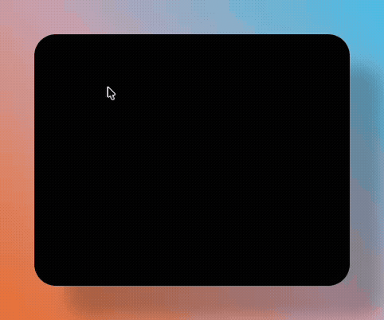

# Claude Usage Tracker (Swift)

A lightweight native macOS menu bar app that displays your Claude usage limits and reset times.


## Features

- **Live usage percentage** in menu bar (5-hour session)
- **Hover countdown** - hover over the percentage to see time until reset with a typewriter animation (hours with ¼½¾ fractions, then minutes and seconds)
- **5-hour session** usage with reset countdown
- **Weekly limits** with reset date
- **Sonnet-specific** weekly limit tracking
- **Extra usage** spending ($X/$Y format)
- **Auto-refresh** every 1, 5, 30, or 60 minutes
- **Native Swift** - no Python, no dependencies
- **Lightweight** - ~50 MB RAM (vs ~90 MB Python version)

## Screenshot

 


### Hover Countdown



## Requirements

- macOS 12.0+
- [Claude Code](https://claude.ai/code) installed and logged in
- Claude Pro or Max subscription

## Installation

### Option 1: Download Release (Easiest)

1. Download `ClaudeUsage.app.zip` from [Releases](https://github.com/cfranci/claude-usage-swift/releases)
2. Unzip and drag to `/Applications`
3. Double-click to run
4. If macOS blocks it: **System Settings → Privacy & Security → Open Anyway**

### Option 2: Build from Source

```bash
git clone https://github.com/cfranci/claude-usage-swift.git
cd claude-usage-swift
./build.sh
open ClaudeUsage.app
```

Or manually:

```bash
swiftc -o ClaudeUsage.app/Contents/MacOS/ClaudeUsage ClaudeUsage.swift -framework Cocoa
open ClaudeUsage.app
```

## How It Works

The app reads Claude Code's OAuth credentials from macOS Keychain and queries the Anthropic usage API:

1. Reads token from Keychain (`Claude Code-credentials`)
2. Calls `api.anthropic.com/api/oauth/usage`
3. Displays utilization percentages and reset times

The usage API is free - no tokens consumed.

## Auto-Start at Login

1. Open **System Settings → General → Login Items**
2. Click **+** under "Open at Login"
3. Select `ClaudeUsage.app`

## Troubleshooting

### "?" in menu bar
- Make sure Claude Code is installed and logged in
- Run `claude` in terminal to verify

### App won't open (macOS security)
- Go to **System Settings → Privacy & Security**
- Find "ClaudeUsage was blocked" and click **Open Anyway**

### Building fails
- Ensure Xcode Command Line Tools: `xcode-select --install`

## Python Version

Looking for the Python version? See [claude-usage-tracker](https://github.com/cfranci/claude-usage-tracker).

## License

MIT
